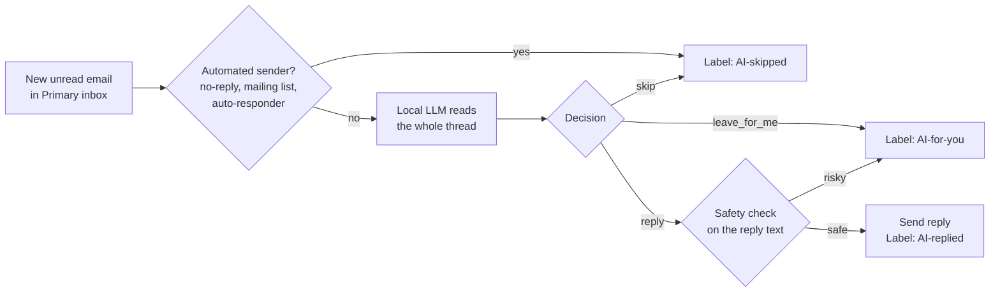

# Gmail Auto-Reply

An email assistant that reads your Gmail inbox, understands each new email with a **local LLM**, and replies automatically when it's safe to do so. Everything runs on your own machine: your emails are never sent to a third-party AI service.

- **Replies** to real people: greetings, thanks, congratulations, festival wishes, status updates, confirmations
- **Skips** company emails: ads, newsletters, notifications, receipts, verification codes
- **Leaves for you** anything that needs your decision: prices, meetings, deadlines, job offers, files, complaints, sensitive news

## How it works



Every minute the script checks for new unread emails in your **Primary** tab. Gmail's own categories already filter out most promotions and social emails. Headers such as `List-Unsubscribe` and `Auto-Submitted` catch the rest of the automated mail before the model sees it.

The model returns a structured decision (`reply`, `skip` or `leave_for_me`) with a short reason. Every handled email gets a Gmail label, so you can see exactly what the assistant did, and no email is ever processed twice.

## Safety

The assistant sends email on your behalf, so there are several layers of protection:

| Protection | What it prevents |
|---|---|
| **Dry run by default** | Nothing is sent unless you explicitly set `DRY_RUN=0` |
| **Code-level reply filter** | Replies mentioning numbers, dates, times, money, meetings, calls, availability or personal details are blocked and left for you, whatever the model decided |
| **No questions** | Questions are removed from replies, so the assistant never asks for information on your behalf |
| **One auto-reply per thread** | Two automated systems can't get stuck replying to each other |
| **Automated-sender detection** | No replies to `noreply` addresses, mailing lists or auto-responders |
| **Prompt-injection handling** | Email content is treated as data; emails that try to give the model instructions are skipped |
| **Fail-safe defaults** | If the model's answer is malformed or unclear, the email is left for you |
| **Fixed format** | The greeting and sign-off are added by code, not the model, so every reply looks the same |

## Requirements

- Python 3.10+
- [Ollama](https://ollama.com) (or any OpenAI-compatible local server, such as LM Studio or llama.cpp)
- A GPU with about 6 GB VRAM for a 7B model (CPU works too, but it's slower)
- A Google account with Gmail

## Setup

### 1. Install dependencies

```bash
git clone https://github.com/saifulislamrumi/auto_reply.git
cd auto_reply
python3 -m venv .venv
.venv/bin/pip install -r requirements.txt
```

### 2. Start the local model

```bash
ollama pull qwen2.5:7b-instruct-q4_K_M
OLLAMA_CONTEXT_LENGTH=16384 ollama serve
```

> Ollama's default context window is small, and long email threads would be cut off without any warning. `OLLAMA_CONTEXT_LENGTH=16384` prevents that.

### 3. Create Google OAuth credentials (one time)

1. Create a project at [console.cloud.google.com](https://console.cloud.google.com/projectcreate).
2. Enable the [Gmail API](https://console.cloud.google.com/apis/library/gmail.googleapis.com).
3. Open **Google Auth Platform**, click **Get started**, and fill in the app name and your email. Choose **External** as the audience.
4. Under **Audience → Test users**, add your Gmail address.
5. Under **Clients → Create client**, choose **Desktop app**, click **Create**, then **Download JSON**.
6. Save the file as `credentials.json` in the project folder.

The first time you run the script, a browser window opens so you can grant access. Google will show an "unverified app" warning. Because this is your own app, choose **Advanced → Go to (app name)**. Your login is then saved to `token.json`.

> While the app is in *Testing* mode, Google ends the login after 7 days. Publish the app under **Audience → Publish app** to stay logged in.

## Usage

```bash
# Dry run: shows what it would do with each email, sends nothing, then exits
.venv/bin/python -u autoreply.py

# Live: sends replies and checks every minute (stop with Ctrl+C)
DRY_RUN=0 .venv/bin/python -u autoreply.py

# Self-check of the filtering and safety logic (no Gmail or LLM needed)
.venv/bin/python autoreply.py --test
```

Example output:

```
LIVE: replies will be sent.
01:06:00 checked inbox: 2 new email(s)

[reply] Tanvir Hasan <tanvir@example.com> | Eid Mubarak
  why: Festival wishes from a friend.
  reply:
    Hi Tanvir,

    Eid Mubarak to you too! Thank you for the kind wishes, and I wish you and your family lots of happiness as well.

    Best regards,
    Saiful Islam Siam

[leave_for_me] Karim <karim@example.com> | Call tomorrow?
  why: Asks about availability and a call.
```

### Gmail labels

| Label | Meaning |
|---|---|
| `AI-replied` | A reply was sent |
| `AI-skipped` | Company or automated email; no reply needed |
| `AI-for-you` | Needs your personal attention |

Emails stay unread, so they still show up in your inbox as usual.

## Configuration

| Setting | Where | Default |
|---|---|---|
| `DRY_RUN` | environment variable | `1` (set `0` to send) |
| `LLM_URL` | environment variable | `http://localhost:11434/v1/chat/completions` (Ollama) |
| `LLM_MODEL` | environment variable | `qwen2.5:7b-instruct-q4_K_M` |
| `CHECK_EVERY_SECONDS` | `autoreply.py` | `60` |
| `SIGNATURE` | `autoreply.py` | `Best regards,\nSaiful Islam Siam` |
| `QUERY` | `autoreply.py` | unread Primary emails from the last 2 days |

To use LM Studio instead of Ollama:

```bash
LLM_URL=http://localhost:1234/v1/chat/completions LLM_MODEL=<model-name> DRY_RUN=0 .venv/bin/python -u autoreply.py
```

### Customizing the assistant

The assistant's behavior is defined by the `SYSTEM` prompt in `autoreply.py`:

- **Role:** whose inbox it is and which names people use
- **Decision rules:** which kinds of email to reply to, skip or leave for you
- **Writing style:** tone, length and formatting rules
- **Examples:** sample emails with ideal replies; the model imitates these closely

To change the writing style, the most effective edit is adding or changing an example. The code-level safety filter (`RISKY` in `autoreply.py`) always applies, whatever the prompt says.

## Limitations

- Replies go to the sender only, not to people in CC.
- For emails that only have an HTML version, the model sees Gmail's short preview text.
- A 7B model occasionally adds small made-up details or misses the right tone. A larger model (for example `qwen2.5:14b`) improves quality if your hardware allows it.
- Emails you open before the next check are treated as handled by you and are not answered.
- The script runs only while your computer is on.

## Privacy

- Emails are processed only by the local model on your machine.
- `credentials.json` and `token.json` give access to your mailbox. They are listed in `.gitignore`; never share or commit them.
- The app uses the `gmail.modify` scope, which lets it read, label and send email. It cannot permanently delete email.

## Project structure

```
autoreply.py       # the whole pipeline: Gmail, LLM decision, safety filter, reply
requirements.txt   # Python dependencies
credentials.json   # your Google OAuth client (not committed)
token.json         # your saved Gmail login (not committed)
```
